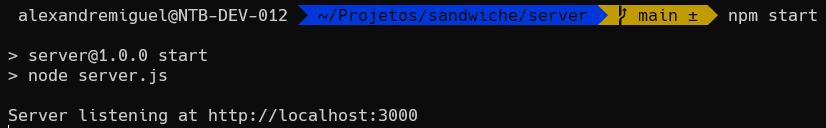
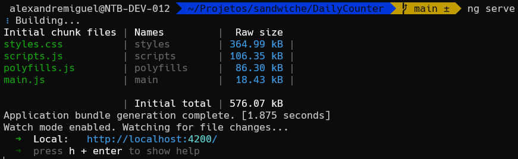
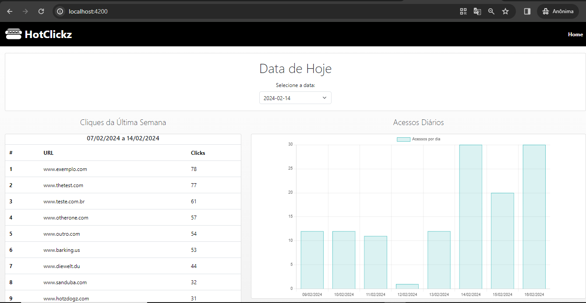

# sandwiche

## Apresentação

O Presente projeto traz uma aplicação em Angular que apresenta uma tabela e um gráfico, alimentados através do acesso a uma API desenvolvida utilizando Node.js.

## Requisitos

Para execução do projeto, os seguintes softwares e versões devem estar instalados no sistema operacional utilizado:

* **Git**
* **Node:** v20.11.1
* **Npm:** 10.2.4
* **Angular CLI:** 17.2.0

## Instalação

### 1. Clone o Repositório

Para realizar a instalação, é necessário navegar até uma pasta de seu sistema operacional e clonar o presente repositório, conforme o seguinte comando:

```bash
$ git clone git@github.com:aleronupe/sandwiche.git
```

### 2. Navegue até o repositório

Após realizar o clone, é necessário navegar até o repositório clonado:

```bash
$ cd sandwiche
$ ls
```

Nele, haverão duas pastas principais, contendo o codigo referente ao backend e ao frontend da aplicação:

- `DailyCounter` - Frontend
- `server` - Backend

### 3. Instale as dependências

Em seguida, é necessário entrar em cada repositório para instalar as dependências, com os seguintes comandos:

```bash
$ cd DailyCounter
$ npm install
```

Após isso, é necessário retornar ao diretório `sandwiche`, entrar no diretório `server` e, novamente, insalar as dependências:

```bash
$ cd ../server
$ npm install
```

### 4. Execute o Backend (`server`)

Com as dependências instaladas, é necessário entrar no repositório `server` e executar o servidor, conforme o seguinte comando:

```bash
$ npm start
```

O Resultado esperado é o log em console do servidor em execução, na porta `3000`.

#### Resultado Esperado



### 5. Execute o Frontend (`DailyCounter`)

Sem interromper a execução da etapa anterior, é necessário abrir uma nova instância do terminal e navegar até o diretório `DailyCounter`. Uma vez nesse diretório, é necessário realizar o comando de início para aplicações em angular:

```bash
$ ng serve
``` 

O Resultado esperado é o log no terminal da aplicação em execução, na porta `4200`

#### Resultado Esperado



### 6. Uso da Plataforma

Uma vez executadas as etapas anteriores, é necessário manter ambos os terminais com os programas em execução, bastando acessar em um browser a URL correspondente para o frontend: `http://localhost:4200/`

A aplicação deve ser apresentada, exibindo a navbar e o footer, bem como a tabela de links acessados nos últimos 7 dias, carregada e atualizada de forma dinâmica, e o gráfico estático dos dados totais dos útlimso 7 dias, ambos obtidos via conexão como backend.

#### Resultado Esperado

